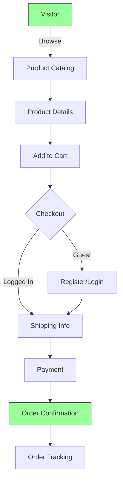
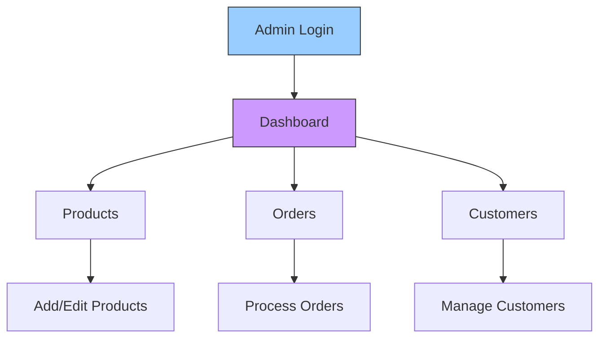

[](https://travis-ci.org/jsdecena/laracom)
[](https://scrutinizer-ci.com/g/Laracommerce/laracom/?branch=master)
[](https://scrutinizer-ci.com/code-intelligence)
[](https://codecov.io/gh/jsdecena/laracom)
[](https://github.com/jsdecena/laracom)
[](https://github.com/jsdecena/laracom)
[](https://gitter.im/larac0m/Lobby)
[](https://app.fossa.io/projects/git%2Bgithub.com%2FLaracommerce%2Flaracom?ref=badge_shield)

# Get discount on Digital Ocean

Sign-up with [Digital Ocean and get $10 discount](https://m.do.co/c/bce94237de96)!

# 🛍️ Laravel E-Commerce Platform

A comprehensive, open-source e-commerce solution built with Laravel, featuring a modern architecture and robust functionality.

## ✨ Key Features

| Feature | Description |
|---------|-------------|
| 🏪 **Products** | Full product management with categories, attributes, and inventory tracking |
| 🛒 **Shopping Cart** | Persistent cart functionality with guest checkout support |
| 💳 **Checkout** | Streamlined multi-step checkout process |
| 📦 **Order Management** | Complete order processing and management |
| 👥 **Customer System** | Customer accounts, profiles, and order history |
| 💰 **Payment Integration** | Multiple payment gateway support |
| 🚚 **Shipping** | Courier integration and shipping management |
| 👔 **Admin Dashboard** | Comprehensive admin interface for store management |

## 🔄 System Flow

### Customer Journey



### Admin Workflow



## 📚 Documentation

For detailed documentation, please visit the [official documentation](https://jsdecena.github.io/laracom).

# Simplified DOCKER setup

## In your teminal, issue these commands

-   RUN `docker-compose up -d --build`
-   If your runtime is apple silicon, use `docker-compose -f docker-compose-m1.yml up -d --build` command
-   RUN `docker exec -it app bash`
-   Inside the container, run `composer install && chmod -R 777 storage/ bootstrap/cache/`
-   Inside the container, run `php artisan migrate --seed`
-   While inside the container, compile the assets with `npm i && npm run dev`
-   While inside the container, link the images `php artisan storage:link`
-   OPEN [http://localhost:8000](http://localhost:8000)

## If you want to use mailhog as SMTP

1.Create a ./mails directory
2.change .env like this

```
MAIL_DRIVER=smtp
MAIL_HOST=mailhog
MAIL_PORT=1025
MAIL_USERNAME=null
MAIL_PASSWORD=null
MAIL_ENCRYPTION=null
MAIL_FROM_ADDRESS="test@example.com"
MAIL_FROM_NAME="${APP_NAME}"
```

3.Go to http://localhost:8025 and verify that the mailhog screen appears

# Author

[Jeff Simons Decena](https://jsdecena.me)

# Contributors

<a href="https://github.com/jsdecena/laracom/graphs/contributors"></a>

## License

[](https://app.fossa.io/projects/git%2Bgithub.com%2FLaracommerce%2Flaracom?ref=badge_large)
