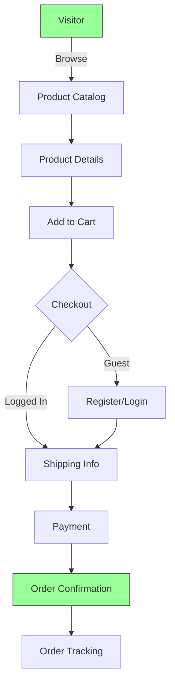
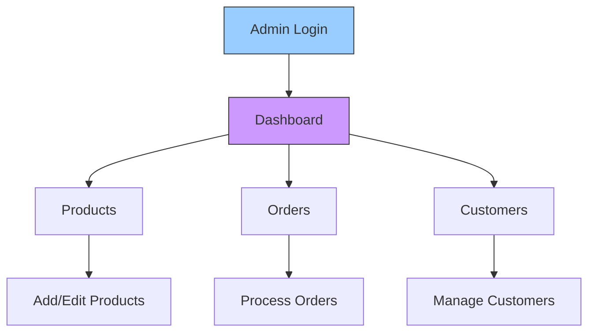

[](https://travis-ci.org/jsdecena/laracom)
[](https://scrutinizer-ci.com/g/Laracommerce/laracom/?branch=master)
[](https://scrutinizer-ci.com/code-intelligence)
[](https://codecov.io/gh/jsdecena/laracom)
[](https://github.com/jsdecena/laracom)
[](https://github.com/jsdecena/laracom)
[](https://gitter.im/larac0m/Lobby)
[](https://app.fossa.io/projects/git%2Bgithub.com%2FLaracommerce%2Flaracom?ref=badge_shield)


# 🛍️ Laracom

Laravel FREE E-Commerce Software. A full-featured, modular e-commerce platform built on Laravel, designed for rapid deployment and scalable management of products, inventory, and orders.


## ✨ Key Features

| Feature | Description |
|---------|-------------|
| 🏪 **Products** | Full product management with categories, attributes, and inventory tracking |
| 🛒 **Shopping Cart** | Persistent cart functionality with guest checkout support |
| 💳 **Checkout** | Streamlined multi-step checkout process |
| 📦 **Order Management** | Complete order processing and management |
| 👥 **Customer System** | Customer accounts, profiles, and order history |
| 💰 **Payment Integration** | Multiple payment gateway support |
| 🚚 **Shipping** | Courier integration and shipping management |
| 👔 **Admin Dashboard** | Comprehensive admin interface for store management |

## 🔄 System Flow

### Customer Workflow



### Admin Workflow




# Installation Process

## Step 1: Clone the repository

```bash
git clone https://github.com/jsdecena/laracom.git
cd laracom
```

## Step 2: Docker Setup

### For standard systems:
```bash
docker-compose up -d --build
```

### For Apple Silicon (M1/M2) systems:
```bash
docker-compose -f docker-compose-m1.yml up -d --build
```

### Access the container:
```bash
docker exec -it app bash
```

### Inside the container, run these commands:
```bash
# Install dependencies and set permissions
composer install && chmod -R 777 storage/ bootstrap/cache/

# Run database migrations and seed initial data
php artisan migrate --seed

# Install and compile frontend assets
npm i && npm run dev

# Create storage link for images
php artisan storage:link
```

## Step 3: Access the Application

Open your browser and navigate to:
```
http://localhost:8000
```

## Optional: MailHog Setup

1. Create a `mails` directory in your project root:
   ```bash
   mkdir -p mails
   ```

2. Update your `.env` file with these mail settings:
   ```
   MAIL_DRIVER=smtp
   MAIL_HOST=mailhog
   MAIL_PORT=1025
   MAIL_USERNAME=null
   MAIL_PASSWORD=null
   MAIL_ENCRYPTION=null
   MAIL_FROM_ADDRESS="test@example.com"
   MAIL_FROM_NAME="${APP_NAME}"
   ```

3. Verify MailHog is running by accessing the web interface at:
   ```
   http://localhost:8025
   ```
   You should see the MailHog web interface where you can view all outgoing emails.

# Author

[Jeff Simons Decena](https://jsdecena.me)

# Contributors

<a href="https://github.com/jsdecena/laracom/graphs/contributors"></a>

## License

[](https://app.fossa.io/projects/git%2Bgithub.com%2FLaracommerce%2Flaracom?ref=badge_large)
